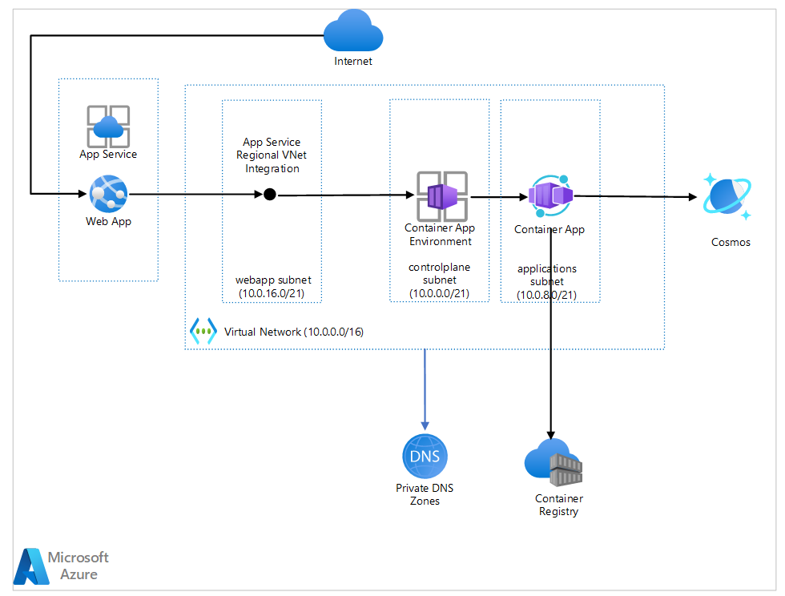
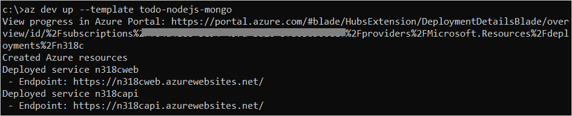

# ToDo Application with Node.js and Cosmos DB (Mongo) Hosted on Azure Container Apps

## ⛔ IMPORTANT

> **Please keep all repositories and templates you create on GitHub.com _private_**
>
> _Please be careful to keep all material private._ 
> _Thanks!_

This repo contains a complete ToDo application that demonstrates how to build, deploy, and monitor an Azure solution using Node.js for API, Cosmos DB (Mongo) for storage, and Azure Monitor for monitoring and logging. This template provides the sample code, tools, and pipelines that serves as a foundation you can build upon and customize when creating your own apps.

This template includes:

- A ToDo app with a web frontend written in React and an API layer in Node.js. Both hosted on [Azure Container Apps](https://azure.microsoft.com/services/container-apps//) 
- Data storage using [Azure CosmosDB API for MongoDB](https://docs.microsoft.com/azure/cosmos-db/mongodb/mongodb-introduction)
- [Azure Monitor](https://docs.microsoft.com/azure/azure-monitor/) for monitoring and logging
- [Azure Key Vault](https://docs.microsoft.com/azure/key-vault/) for securing secrets

Here's a high level architecture diagram that illustrates these components. Notice that these are all contained within a single [resource group](https://docs.microsoft.com/azure/azure-resource-manager/management/manage-resource-groups-portal), that will be created for you when you create the resources.

> UPDATE TO THIS DIAGRAM COMING SOON


Because this template intends to be a foundation, not just an example, we create infrastructure commonly used in a production environment. You should be aware that there is a cost associated with running this template. The monthly cost, for a location in the United States, e.g. `eastus`, will be around $50 USD. Expand the following section for more information regarding cost. This cost is prorated daily, and instructions on how to remove the created infrastructure are included at the end of this document.

> UPDATE TO COST DETAILS COMING SOON

<details>
  <summary>Cost details</summary>

## Estimated Monthly Costs

The following table provides an example cost breakdown (as of Feb 2022) for deploying this template in the East US location. The below assumptions are used:

- Key Vault: <=10,000 transactions a month for secrets operations.
- Azure Monitor (based on **Pay-As-You-Go** tier): the daily log data depends on what you are monitoring with Log Analytics and Application Insights. We assume 0.3 GB/month daily logs for trial.

| Service Type        | Description                                                                                                                                                                                                                                                                                                                                                        | Estimated monthly cost |
| ------------------- | ------------------------------------------------------------------------------------------------------------------------------------------------------------------------------------------------------------------------------------------------------------------------------------------------------------------------------------------------------------------ | ---------------------- |
| App Service         | Basic Tier; 2 B1 (1 Core(s), 1.75 GB RAM, 10 GB Storage) x 730 Hours; Linux OS                                                                                                                                                                                                                                                                                     | $24.82                 |
| Key Vault           | Vault: 1 operations, 0 advanced operations, 0 renewals, 0 protected keys, 0 advanced protected keys; Managed HSM Pools: 0 Standard B1 HSM Pool(s) x 730 Hours                                                                                                                                                                                                      | $0.03                  |
| Azure Cosmos DB     | Serverless, Single Region Write (Single-Master); 20 million RUs; 0 GB transactional storage, 2 copies of periodic backup storage; Dedicated Gateway not enabled                                                                                                                                       | $5.00                 |
| Azure Monitor       | Log analytics: 0.3 GB Daily logs ingested, 1 month Data retention; Application Insights: 0.3 GB Daily logs ingested, 3 months Data retention, 0 Multi-step Web Tests; 1 VM monitored X 1 metric monitored per VM, 1 Log Alert at 15 Minutes Frequency, 0 Additional events, 0 Additional emails, 0 Additional push notifications, 0 Additional web hooks (in millions) | $19.00              |
| **Estimated total** |                                                                                                                                                                                                                                                                                                                                                                    | **$48.85**            |

<sup>Please refer to the [Pricing calculator for Microsoft Azure](https://azure.microsoft.com/pricing/calculator/) and adjust based on your use case.</sup>

</details>

## Let's go! Get up and running in minutes

Let's jump in and get the ToDo app up and running in Azure. When you are finished, you will have a fully functional web app deployed on Azure. In later steps, you'll see how easy it is to setup DevOps pipeline and monitor the application.


<sup>Screenshot of the deployed ToDo app</sup>

### Prerequisites

This template uses an infrastructure as code approach to creating Azure resources and deploying application code. You could deploy this template using files located in the `infra` folder, but the easiest way to leverage the template is by using the [Azure Developer CLI](https://aka.ms/azure-dev/overview). `az dev` is a developer-focused command line that simplifies the creation and configuration of Azure resources, deployment of applications, and DevOps pipelines. It leverages common tools used by developers.

Before you get started, ensure you have the following tools installed on your local machine:

- [Docker](https://docs.docker.com/get-docker/)
- [Git](https://git-scm.com/)
- [GitHub CLI](https://github.com/cli/cli)
- [Node.js with npm (v 16.13.1 LTS)](https://nodejs.org/) - To run locally
- [Azure CLI (v 2.30.0+)](https://docs.microsoft.com/cli/azure/install-azure-cli)
- Azure ContainerApps CLI Extension
  - `az extension add --name containerapp`
- Azure Dev CLI Extension (See install instructions below)

#### Install the Azure Dev CLI Extension

The Azure Developer CLI, `az dev` enables you to execute the commands in this template. Run the following commands to install the Azure Developer CLI.

> The following will be replaced with `az extension add --name azure-dev` once we are public.

```bash
az config set extension.index_url=https://azuresdkreleasepreview.blob.core.windows.net/azd/whl/latest/index.json
az extension add --name azure-dev
az config unset extension.index_url
```

### Project Folder

You will need an empty folder on your computer to house the project files that will be copied from this repository.

1. Open your favorite terminal and create a new folder.

```bash
mkdir {your-unique-project-folder-name}
```

2. Now, set your current directory to that newly created folder.

```bash
cd {your-unique-project-folder-name}
```

### Azure Subscription

This template will create infrastructure and deploy code to Azure. If you don't have an Azure Subscription, sign up for a [free account here](https://azure.microsoft.com/free/). 

## Quickstart

The fastest possible way for you to get this app up and running on Azure is to use the `az dev up` command. This single command will create and configure all necessary resources. Because this will create all of the resources on Azure, it can take some time. You will see an indication of the CLI progress as it creates the resources.

The `az dev up` command will:

1. Get a local copy of this repository and initialize the project
2. Create all the Azure resources required by this application
3. Deploy the code you need to run the application

Run the following command to create Azure resources, build, and deploy this application to Azure in a single step.

```bash
az dev up -t todo-nodejs-mongo-aca
```

> NOTE: This may take a while to complete as it performs three steps: `az dev init` (initialize your local environment), `az dev provision` (creates Azure services) and `az dev deploy` (deploys code).

You will be prompted for the following information:

- `Environment Name`: This will be used as a prefix for all your Azure resources, make sure it is unique and under 15 characters.
- `Azure Location`: The Azure location where your resources will be deployed.
- `Azure Subscription`: The Azure Subscription where your resources will be deployed.

This command will print URLs to the following:

- Azure Portal link to view resources created
- ToDo web application frontend
- ToDo API application



Click the web application URL to launch the ToDo app. Create a new collection and add some items. This will create some behavior in the application that you will be able to see later when you `monitor` the application.

> :warning: **Cleanup**
>
> Please be aware that Azure resources, e.g. a Cosmos DB, have been created. You can clean up these resources by deleting the resource group that was create, or issuing the `az dev infra delete` command.

### Next Steps

At this point, you have a complete application deployed on Azure. But there is much more that the Azure Developer CLI can do. These next steps will introduce you to additional commands that will make creating applications on Azure much easier. Using the Azure Developer CLI, you can setup your DevOps pipelines, monitor your application, test and debug locally.

#### Set up DevOps pipeline using `az dev pipeline`

This template includes a GitHub Actions pipeline configuration file that will deploy your application whenever code is pushed to the main branch. You can find that pipeline file here: `.github/workflow`

Setting up this pipeline requires you to give GitHub permission to deploy to Azure on your behalf, which is done via a Service Principal stored in a GitHub secret named `AZURE_CREDENTIALS`. The `az dev pipeline config` command will automatically create a service principal for you or you could pass an existing service principal id to this command.

Add local source code to a new **private** GitHub repo. 

>**Important to keep the repository private.**

Run the following command to set up a GitHub Action

```
az dev pipeline config
```

#### Monitor the application using `az dev monitor`

> COMING SOON!

To help with monitoring applications, the Azure Dev CLI provides a `monitor` command to help you get to the various Application Insights dashboards.

- Run the following command to open the "Overview" dashboard:

  ```bash
  az dev monitor --overview
  ```

- Live Metrics Dashboard

  Run the following command to open the "Live Metrics" dashboard:

  ```bash
  az dev monitor --live
  ```

- Logs Dashboard

  Run the following command to open the "Logs" dashboard:

  ```bash
  az dev monitor --logs
  ```

#### Run and Debug Locally

The easiest way to run and debug is to leverage the Azure Developer CLI Visual Studio Code Extension. Refer to this [walkthrough](https://aka.ms/azure-dev/vscode) for more details.  

> BETTER EXPERIENCE COMING SOON.

For now, you need to prep the local environment with the following:

1. cd to `src/api` and run `npm i`
1. cd to `src/web` and run `npm i`

### Additional az dev commands

Here is a quick list of commonly used `az dev` command. For a complete list of available commands please refer to the [az dev overview](https://aka.ms/azure-dev/overview).

#### `init`

Gets a local copy of a specific repository if `--template` is specified and initializes the project:

```bash
az dev init --template todo-nodejs-mongo
```

> NOTE: All project configuration settings are stored in the `.azure/{environment name}/.env` file.

#### `infra delete`

Deletes all the resources created on Azure.

```bash
az dev infra delete
```

#### `provision` aka `infra create`

Creates all the necessary Azure resources for the template.

```bash
az dev provision
```

#### `deploy`

Deploys the application.

```bash
az dev deploy
```

#### `infra delete`

Deletes Azure resources.

```bash
az dev infra delete
```

## Troubleshooting

Sometimes, things go awry. If you happen to run into issues, here are some things to check out.

- Verify that all prerequisites are installed, e.g. Github CLI.
- The Az Dev CLI assumes that folders under .azure folder are dev CLI environments. Do not run `az dev` commands from the home directory of a user that has Azure CLI installed.
- Environment name is used as a prefix to the name of each Azure resource created for this project. Azure resources have [naming rules and restrictions](https://docs.microsoft.com/azure/azure-resource-manager/management/resource-name-rules), make sure you use a name that is less than 15-character long and unique.
- `az dev up` and `az dev provision` require the latest release of az bicep cli. Run `az bicep upgrade` if you this: "Error: failed to compile bicep template: failed running az bicep build: exit code: 1, stdout: , stderr: WARNING: A new Bicep release is available: v0.4.1272. Upgrade now by running "az bicep upgrade"."
- If `az dev up` or `az dev provision` fails, go to the [Azure Portal](https://portal.azure.com), locate your resource group which is `<your-environment-name>rg`. Click link under **Deployments** to get more information.
  > Additional resource: [Troubleshoot common Azure deployment errors - Azure Resource Manager](https://docs.microsoft.com/azure/azure-resource-manager/troubleshooting/common-deployment-errors)
- If `az dev pipeline` fails to deploy your latest change, verify that you have specified a basename that is the same as your environment name. You can also go to `https://github.com/<your repo>/actions` and refer to the log in the pipeline run to get more information.
- Text-based browser is currently not supported by `az dev monitor`.
- Live Metrics (`az dev monitor --live`) is currently not supported for Python app refer to [this](https://docs.microsoft.com/azure/azure-monitor/app/live-stream#get-started) for more information.

## Security

### Roles

This template creates a [managed identity](https://docs.microsoft.com/azure/active-directory/managed-identities-azure-resources/overview) for your app inside your Azure Active Directory tenant, and it is used to authenticate your app with Azure and other services that support Azure AD authentication like Key Vault via access policies. You will see principalId referenced in the infrastructure as code files, that refers to the id of the currently logged in Azure CLI user, which will be granted access policies and permissions to run the application locally. To view your managed identity in the Azure Portal, follow these [steps](https://docs.microsoft.com/azure/active-directory/managed-identities-azure-resources/how-to-view-managed-identity-service-principal-portal).

### Key Vault

This template uses [Azure Key Vault](https://docs.microsoft.com/azure/key-vault/general/overview) to securely store your Cosmos DB connection string for the provisioned Cosmos DB account. Key Vault is a cloud service for securely storing and accessing secrets (API keys, passwords, certificates, cryptographic keys) and makes it simple to give other Azure services access to them. As you continue developing your solution, you may add as many secrets to your Key Vault as you require.

## Reporting Issues and Feedback

If you encounter any bugs, please file an issue in [Issues](https://aka.ms/azure-dev/issues).

Go to the [Discussions](https://aka.ms/azure-dev/discussions) to keep posted with updates, ask a question or share ideas. 

You may also contact us via AzDevTeam@microsoft.com. 